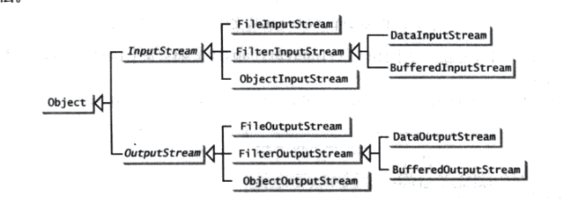

计算机并不区分二进制文件和文本文件.所有的文件都是以二进制形式进行存储的,因为从本质上来说,所有的文件都是二进制文件.

二进制IO

### 主要使用到的类
* InputStream
* OutputStream
* FileInputStream
* FileOutputStream

---

从外部文件中将数据输入到程序中,使用FileInputStream,必须保证外部文件已经存在

将程序中的数据输出到外部文件中,如果外部文件不存在就直接创建该文件,不用确保文件是否已经存在,
但是在某些逻辑中,会让你判断如果文件已经存在就停止向这个文件进行输出操作,防止旧文件内容被删除;

---

###FilterInputStream和FilterOutputStream

包含子类:*DataInputStream*和*DataOutputStream*

过滤器数据流,用来包装普通的IO流,通过包装的过滤器流进行整数值,双精度,字符串的读取和输入

---

###BufferInputStream和BufferOutputStream

BufferInputStream和BufferOutputStream可以通过减少读写次数来提高输入和输出的速度,它们为存储字节在流中添加一个缓冲区,以提高处理效率

如果没有设置缓存区的大小,默认的大小就是512个字节.缓冲区输入流会在每次调用中尽可能多地将数据读入缓冲区.相反地,只有当缓冲区已满或调用flush()
方法时,缓冲输出流才会调用写入方法.

---

###ObjectInputStream和ObjectOutputStream

---
---
---

文本IO

